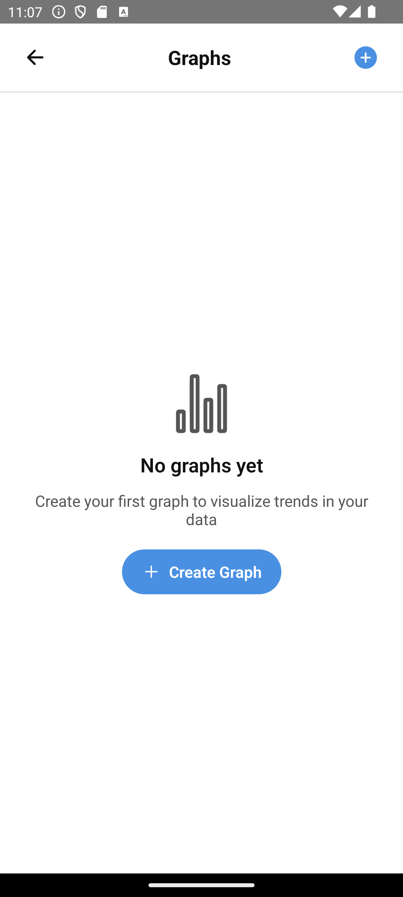

# Creating Graphs

Based on: [06-graphing.md](../../stories/06-graphing.md)

**Persona**: Bob wants to visualize trends and correlations in his health data.

**Preconditions**: Bob has been logging entries for several weeks.

---

## Step 1: Viewing Saved Graphs

Bob taps the Graphs section to see graphs he's created. Each graph tracks specific items over time.

---

## Step 2: No Graphs Yet

If Bob hasn't created any graphs, he sees an invitation to create his first one.

---

## Step 3: Creating a New Graph

Bob wants to see if peanuts correlate with his headaches. He selects the items and date range for his new graph.

---

## Step 4: Viewing a Graph

Bob sees his generated graph showing peanut consumption and headache intensity over time. He can share it with his doctor.

---

## What's Next?

Bob has insights into his health patterns. He wants to share his data securely with his healthcare team.

→ Continue to [Sereus Network](05-sereus-network.md)

