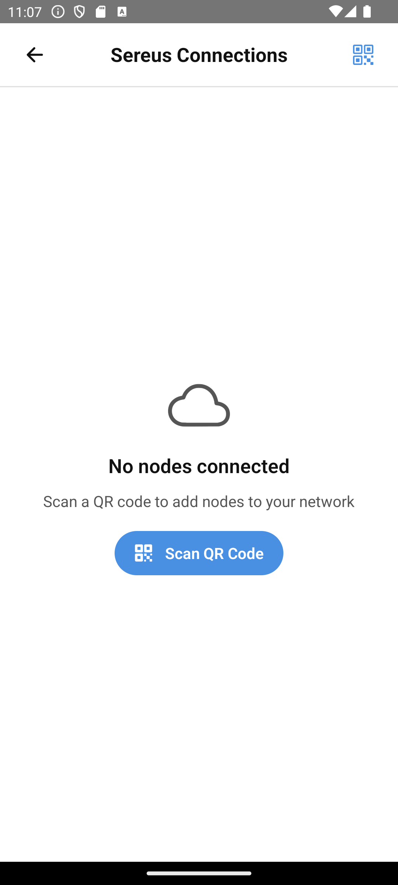

# Sereus Network

Based on: [07-networking.md](../../stories/07-networking.md)

**Persona**: Bob wants to connect additional nodes for data redundancy and sharing with his doctor.

**Preconditions**: Bob has a Sereus node set up and wants to add it to his network.

---

## Step 1: Opening Settings

Bob taps the Settings tab to access app configuration.

---

## Step 2: Viewing Connections

Bob taps "Sereus Connections" to see his current network nodes.

---

## Step 3: Empty Network

If Bob hasn't connected any nodes yet, he sees instructions for scanning a QR code.

---

## Step 4: Adding a Node

Bob scans a QR code from his cloud node. The app prompts him to confirm adding the node to his cadre. His data will now sync to this node.

---

## Step 5: Adding a Guest Node

At his doctor's office, Bob scans their QR code. This adds the doctor's node as a "guest" - they can read his data but he doesn't control their node.

---

## What's Next?

Bob's data is now distributed across multiple nodes for safety. He wants to set up reminders to log regularly.

→ Continue to [Reminders](06-reminders.md)

