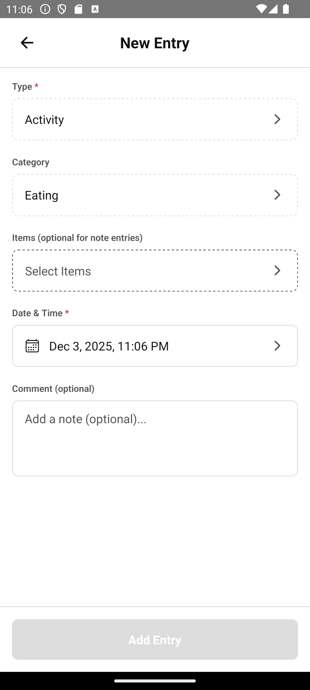

# Screenshots

| Screen | Variant | Preview |
|--------|---------|---------|
| LogHistory | happy |  |
| LogHistory | empty |  |
| EditEntry | new |  |
| EditEntry | clone |  |
| ConfigureCatalog | happy |  |
| ConfigureCatalog | empty |  |
| EditItem | new |  |
| EditItem | edit |  |
| EditBundle | new |  |
| EditBundle | edit |  |
| Graphs | happy |  |
| Graphs | empty |  |
| GraphCreate | - |  |
| GraphView | - |  |
| Settings | - |  |
| SereusConnections | happy |  |
| SereusConnections | empty |  |
| Reminders | - |  |
