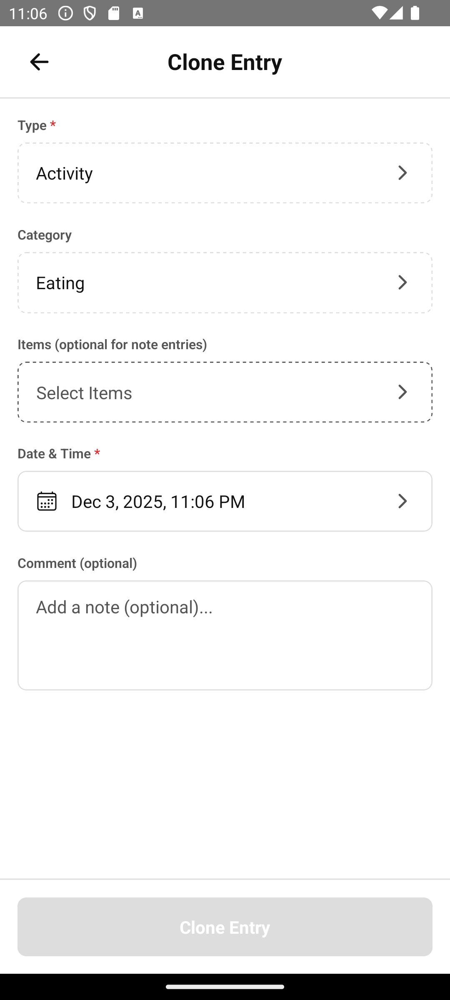

# Daily Logging

Based on: [02-daily.md](../../stories/02-daily.md)

**Persona**: Bob has been using the app and wants to log various types of entries.

**Preconditions**: Bob has the app set up with some categories and items.

---

## Step 1: Viewing History

Bob opens the app and sees his recent log entries. Each card shows the type, items logged, and timestamp.

---

## Step 2: Cloning a Previous Entry

Bob had the same breakfast as yesterday. Instead of entering everything again, he taps the clone icon on yesterday's breakfast entry.

---

## Step 3: Adding an Outcome

Bob wants to log that he's experiencing stomach pain. He creates a new entry and selects "Outcome" → "Pain".

---

## Step 4: Setting Quantifiers

For his stomach pain, Bob sets the intensity to 7 on a scale of 1-10. He also adds a comment noting when it started.

---

## What's Next?

Bob now regularly logs activities, conditions, and outcomes. He's ready to configure his catalog with more items.

→ Continue to [Configuring Catalog](03-configuring-catalog.md)

